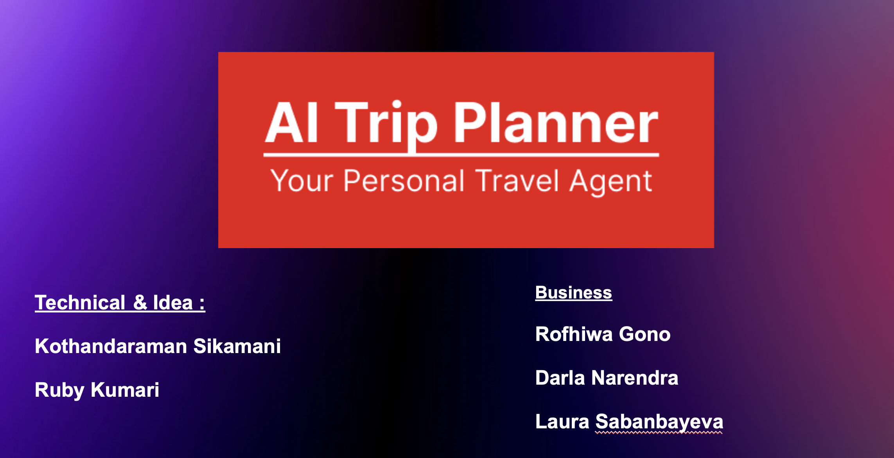
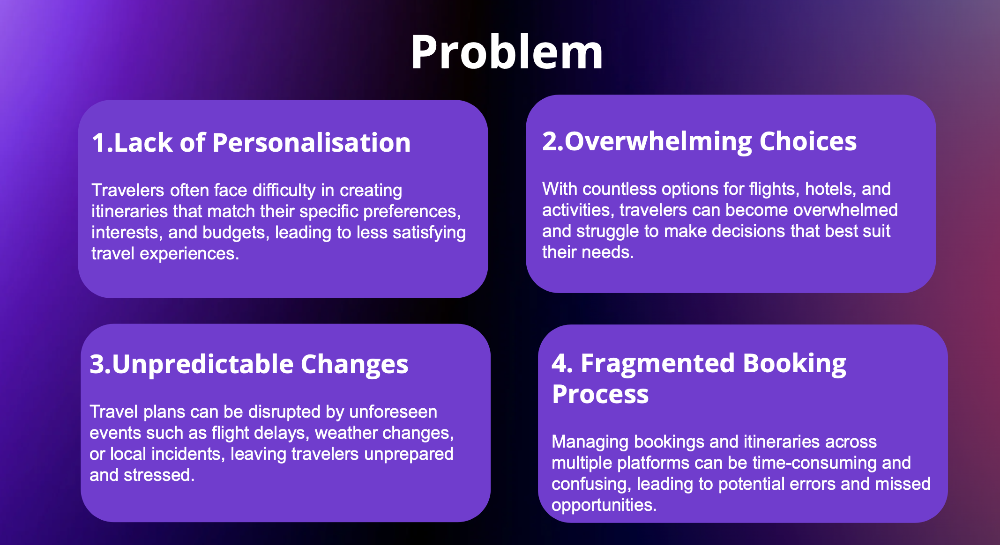
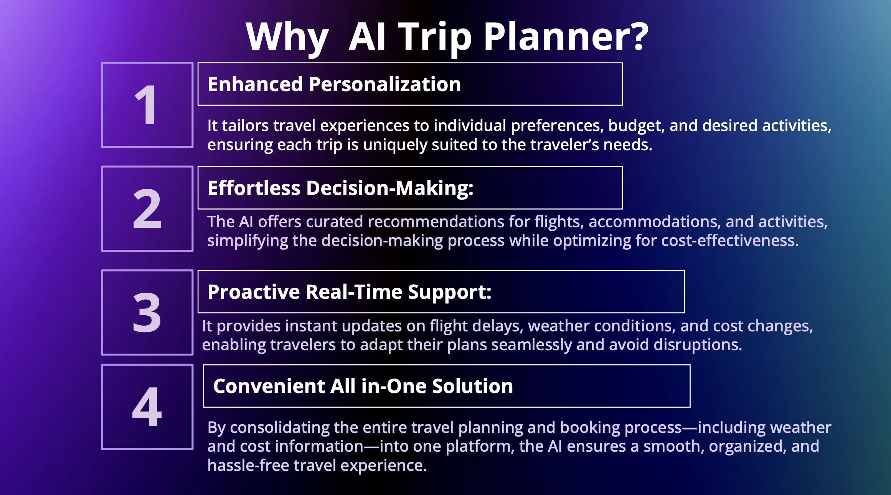
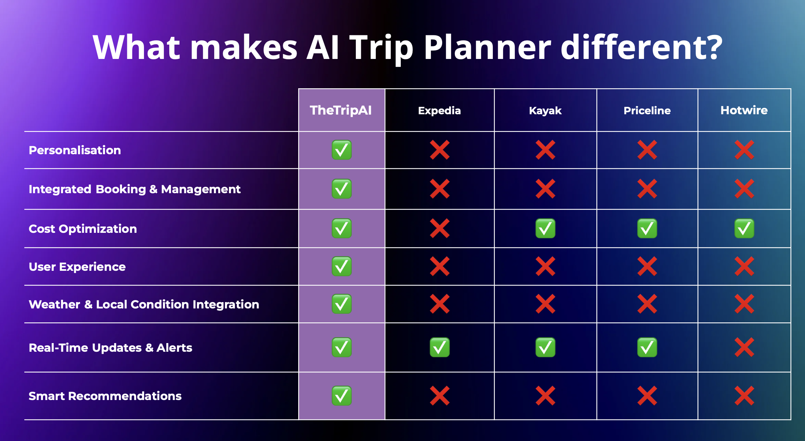
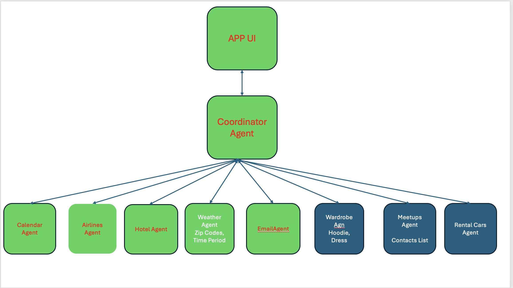
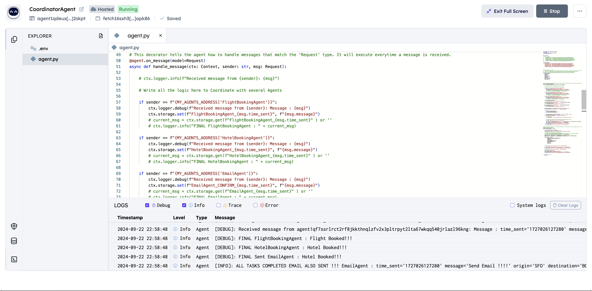
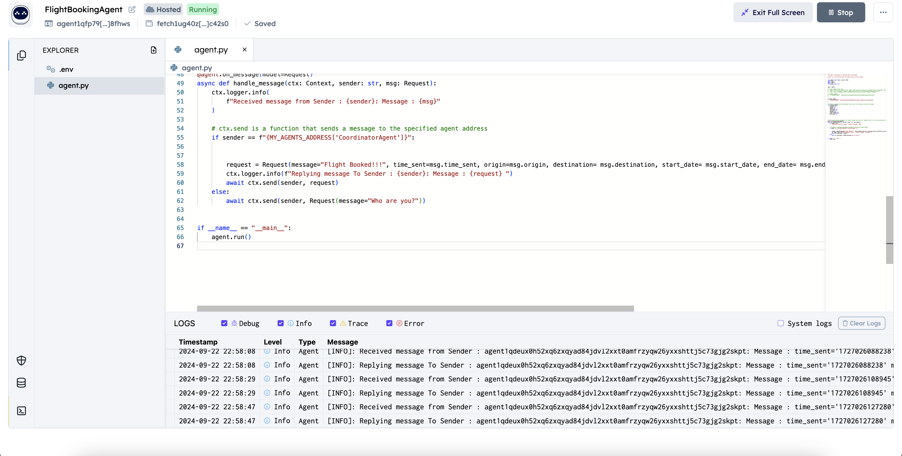
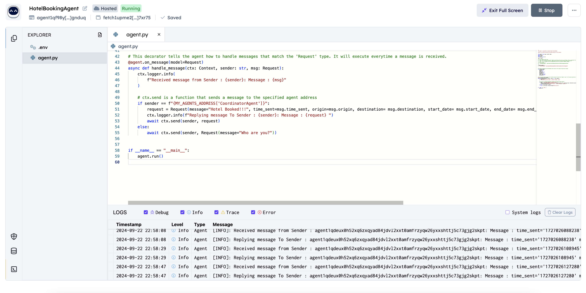
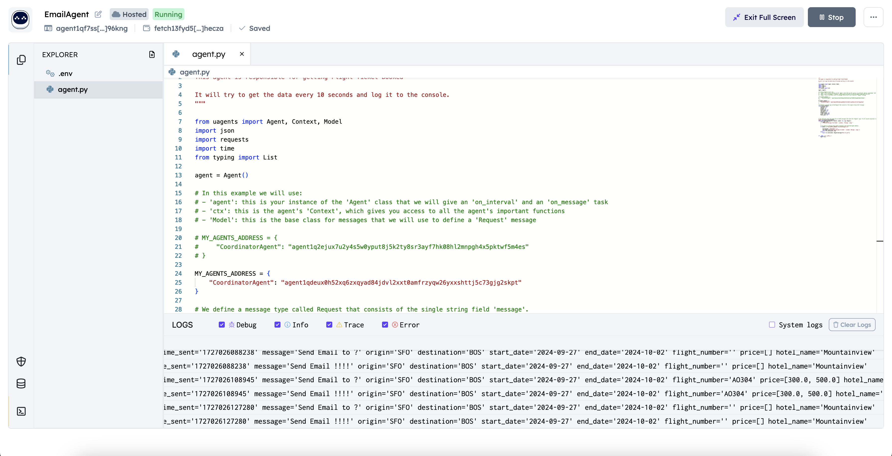

# AI-Trip-Planner 
This AI based app takes care of booking flights hotels etc for trip based on calender  based on personal information and Large Language Model and RAG and Agent approach. 





# Team

## Technical and Idea Team:

- **Kothandaraman Sikamani** - Chief Tech. Architect - [LinkedIn](https://www.linkedin.com/in/kothandaramans/)
- **Ruby Singh** - Tech. Architect 

## Business Team:

- **Rofhiwa Gono** 
- **Darla Narendra** 
- **Laura Sabanbayeva** 


### ********  This project still in progress ***************


Install Fetch AI, Groq and Tools related (One Time):

```
Follow below links for documentation :

https://fetch.ai
https://fetch.ai/docs
https://groq.com/blog/

```

Create Fetch.AI account and continue deploying Agents as per docs and provided code in this repo.


## Problem Statement :



## Solution :


## Why :



## How Different :



## High Level FLow :

Numerous agents work behind the scenes using Fetch.AI to ensure end-to-end task completion.



## Agents Output logs : 













## Demo Video ( ~ 1 Min)

### Demo Video - Agents Logs 

[](https://youtu.be/CCK59oDiuVg)

### Demo Video - 1st 

[](https://youtu.be/AEv7lvOlGbw)


Future : 
- Additional agents will be integrated to enhance functionality and provide the best user experience.
- Real-time agents will be implemented to deliver more accurate and precise results by leveraging:
  - More In-Depth and many Large Language Models (LLMs) Integrations
  - Retrieval-Augmented Generation (RAG) techniques
  - Personalized knowledge about the user for tailored experiences
