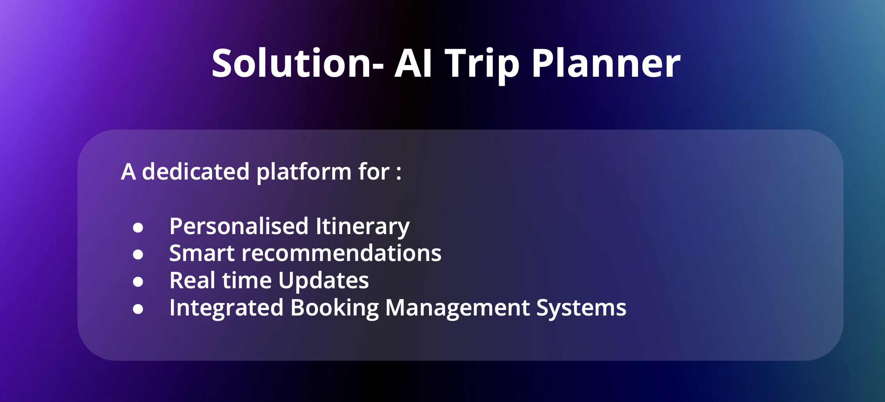

# TheTrip.ai - ai-trip-planner 
This AI based app takes care of booking flights hotels etc for trip based on calender  based on personal information and Large Language Model and RAG and Agent approach. 

# Team

## Technical and Idea Team:

- **Kothandaraman Sikamani** - Chief Tech. Architect - [LinkedIn](https://www.linkedin.com/in/kothandaramans/)
- **Ruby Singh** - Tech. Architect 

## Business Team:

- **Rofhiwa Gono** 
- **Darla Narendra** 
- **Laura Sabanbayeva** 

# This page still Work in progress 

# Install Fetch AI, Groq and Tools related (One Time):

# Follow the documentation from 

```
https://fetch.ai
https://fetch.ai/docs
https://groq.com/blog/

```

Create Fetch.AI account and continue deploying Agents as per docs and provided code in this repo.


## Problem Statement :


## Solution :



## Why :


## How Different :


## High Level FLow :

Numerous agents work behind the scenes using Fetch.AI to ensure end-to-end task completion.


## Agents Output logs : 


## Demo Video ( ~ 1 Min)

[](images/1_min_demo.mp4)

Future : 
- Additional agents will be integrated to enhance functionality and provide the best user experience.
- Real-time agents will be implemented to deliver more accurate and precise results by leveraging:
  - Large Language Models (LLMs)
  - Retrieval-Augmented Generation (RAG) techniques
  - Personalized knowledge about the user for tailored experiences
